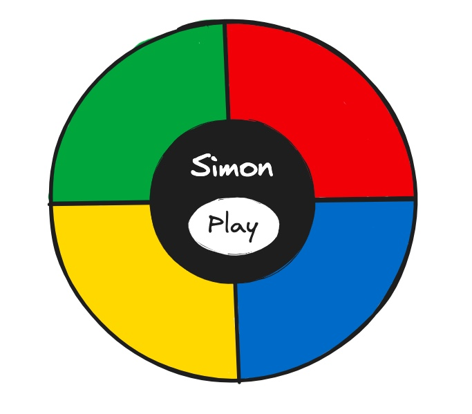

# Simon Game in React

## Overview

1. [Description](#description)
2. [Deployment Link](#deployment-link)
3. [Installation](#installation)
4. [Technologies Used](#technologies)
5. [Deliverables](#deliverables)
6. [Planning/Build Process](#planning)
7. [Challenges](#challenges)
8. [Wins](#wins)
9. [Key Learnings & Takeaways](#takeaways)
10. [Future Improvements](#future-improvements)

---

## <a name="description"></a> 1. Description

- Revamping of simon game [previously written in vanilla JavaScript](https://github.com/katieloesch/simon-vanilla-js)

The player can start the game by clicking the start button. The game will start to blinking a color from the four buttons. You need to follow the blinking color by tapping the button accordingly. Try to tap all the blinking colors in order to win this game.
practice using react hooks

Simon is a test of memory. Have your program choose a sequence of different colors at random and then prompt your player repeat the sequence allowing them to go to advance to next round if the player is successful.

## <a name="deployment-link"></a> 2. Deployment link

https://simon.katieloesch.co.uk/

## <a name="installation"></a> 3. Installation

- package manager used: npm - v9.5.0
  - https://www.npmjs.com/package/npm
- to install dependencies, run:
  ```zsh
   npm install
  ```
- to start application, run:
  ```zsh
   npm start
  ```

## <a name="technologies"></a> 4. Technologies Used

- This application is based in ReactJS (v18.2.0), JavaScript, JSX and SCSS.

  - it was created using the 'create-react-app' command
  - https://create-react-app.dev/

    ```zsh
    npx create-react-app .
    ```

### UI

- fonts:
  - 'Gajraj One' designed by Saurabh Sharma
    - source: BestFonts.pro
      - https://en.bestfonts.pro/font/gajraj-one
    - also available from Google Fonts:
      - https://fonts.google.com/specimen/Gajraj+One
    - .woff file: assets/fonts directory
- icons:
  - iconify
    - https://icon-sets.iconify.design/
  - fontawesome
    - https://fontawesome.com/
- sound effects: freeCodeCamp
  - https://adamrecvlohe.com/tutorials/2018-10-13-lets-build-a-simon-game-in-reasonreact-pt-3-sounds/

### Additional tools used:

- Git / GitHub
  - used for version control
  - https://git-scm.com/
  - https://github.com/https://github.com/
- Visual Studio Code (VSCode)
  - code editor used for writing CSS, JSX and JavaScript
- Google Chrome browser
  - used for launching the website and displaying the application Google Chrome
- Google Chrome Developer Tools: For troubleshooting and debugging
  - https://www.google.com/intl/en_uk/chrome/
- Hostinger: provider used to host the game online
  - https://www.hostinger.co.uk
- Excalidraw
  - used for building the wireframe
  - https://excalidraw.com/

### Resources and tutorials:

- [Learn React Hooks by Coding the Simon Game](https://www.youtube.com/watch?v=QoA_qDW5FyQ) by [Coding Spot](https://www.youtube.com/@codingspot)
  - code: [react-simon-game-yt](https://github.com/AlejoG10/react-simon-game-yt) by [AlejoG10](https://github.com/AlejoG10)

## <a name="deliverables"></a> 5. Deliverables

### MVP

- a working game hosted online
- a git repository hosted on Github, including:

  - a link to the hosted game
  - frequent commits dating back to the very beginning of the project
  - code that is well-formatted and well-commented
  - semantic markup for HTML and CSS while adhering to best practices
  - adherence to KISS (Keep It Simple Stupid) and DRY (Don't Repeat Yourself) principles

- a Simon game with the following features:

  - visually display 4 different game panels
  - generate a random sequence when the game starts
  - visually show the random squence using the 4 different panels by making them look different
  - once the sequence has flashed the user can enter a sequence using the same panels
  - if the user enters the correct sequence the game continues and the sequence is incremented
  - if the user enters a wrong panel the game is lost
  - after losing a game the player can start a new game by clicking a button

- the website should also:
  - include contact information -> email, GitHub, LinkedIn and other relevant links
  - have a mobile-responsive design

### Potential Extra Features

- score board to keeping track
- strict mode
- use localStorage to persist data locally
- include audio + mute mode
- inventive styling (e.g. hover effects, animations)
- multiple players

### User Stories

- As a user, I should be able to start a new Simon game.
- As a user, I should be able to play the game again without refreshing the page.
- https://en.wikipedia.org/wiki/Simon_(game)
- https://www.ultraboardgames.com/simon/game-rules.php

## <a name="planning"></a>6. Planning / Build Process

This was a solo project I built over the course of 3 non-consecutive days.

### Day 1 - 24/01/2024

I started this project by setting up a react app using the 'create-react-app' command.

```zsh
npx create-react-app .
```

After removing unnecessary files from the newly created project, I made a 'components' folder to store all the different react components needed for the game.

- header -> for the title and game instructions
- game -> for the simon game
- panel -> for the 4 individual game panels of the simon game
- contact icons -> to display links to LinkedIn/GitHub/portfolio/email

- I created repository on GitHub and connected it to the local project.
- started building JSX compnents + styling
- started game logic
- read up on useEffect and useRef hooks
  - https://react.dev/reference/react/useEffect
  - https://www.w3schools.com/react/react_useeffect.asp
  - https://react.dev/reference/react/useRef
  - https://www.w3schools.com/react/react_useref.asp

I also created a wireframe on Excalidraw to get an idea of the basic layout of the website.

### Day 2 - 01/02/2024

- finish game logic and additional styling
- mute mode
- strict mode

### Day 3 - 02/02/2024

- start readme file



## 7. <a name="challenges"></a> Challenges

- strict mode v non strict mode
- audiofiles

## 8. <a name="wins"></a> Wins

- game logic
- using react hooks: useEffect + useRef

## <a name="takeaways"></a> 9. Key Learnings & Takeaways

- although I enjoyed building this project with React.js I don't think this version of the project is a huge improvement on the vanilla Javascript version as the game features are very similar.

## <a name="future-improvements"></a> 10. Future Improvements

- option for multiple players
- scoreboard to keep track
- sound effects + animations
